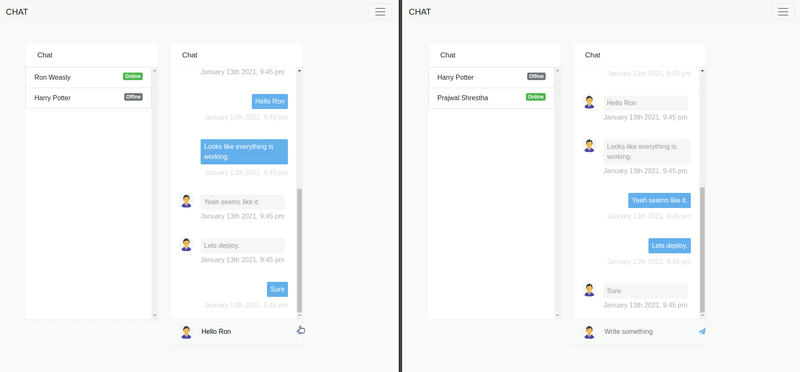
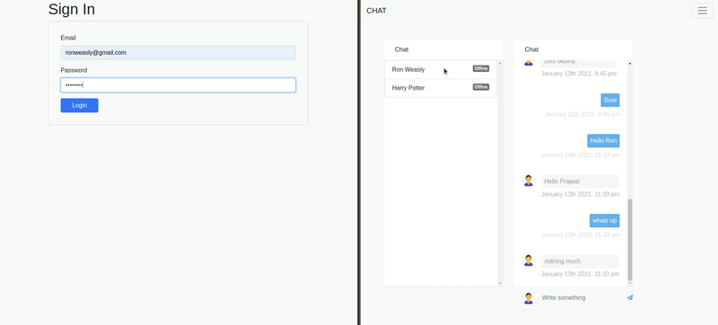

# Chat application with Socket IO

Realtime chat application powered by Node Js, React and Sockets.    
This is the backend repository built with [Node Js](https://nodejs.org/en/) and [Express](https://expressjs.com/). 

## Related repositories

You can find the frontend made in [React JS](https://reactjs.org/) from this link: [Frontend Repository with React Js](https://github.com/PJMessi/react-node-chat).  
You can find the frontend made in [Vue Js](https://vuejs.org/) from this link: [Frontend Repository with Vue Js](https://github.com/PJMessi/vue-todo). 

## Tech used

1. [Node Js](https://nodejs.org/en/) and [Express](https://expressjs.com/) at the backend.
2. [React Js](https://reactjs.org/) at the frontend.
3. [Socket IO](https://socket.io/) for realtime.
4. [Postgres](https://www.postgresql.org/) for database.

## Additional features
1. Welcome email for new user.

## Demo

[React frontend demo on heroku](https://pjmessi-react-chat.herokuapp.com/)   
[Nodejs express backend demo on heroku](https://github.com/PJMessi/node-chat)

## Chat demo gif

## User status demo gif

## Guide

1. Clone the repository.
2. Install the dependencies:  
    `npm install`
3. Create .env file and fill that up. (See .env.example to know what you have to set in .env).
4. Run:   
    `npm run dev`

<!-- ## Learn More

You can learn more in the [Create React App documentation](https://facebook.github.io/create-react-app/docs/getting-started).

To learn React, check out the [React documentation](https://reactjs.org/). -->
